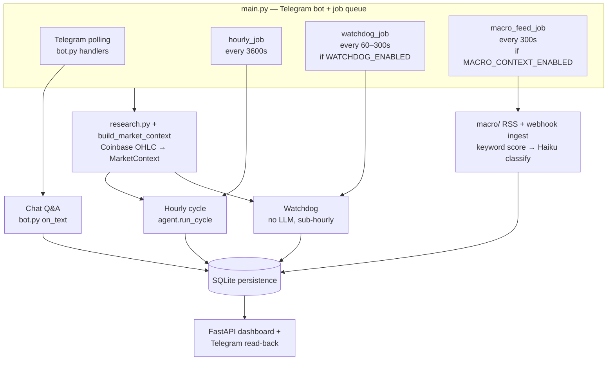
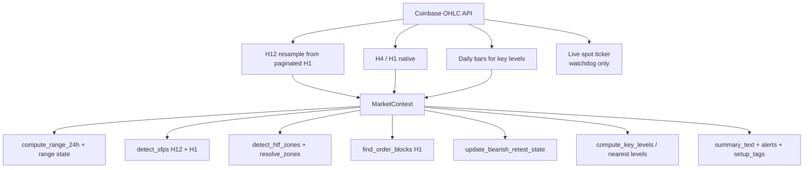
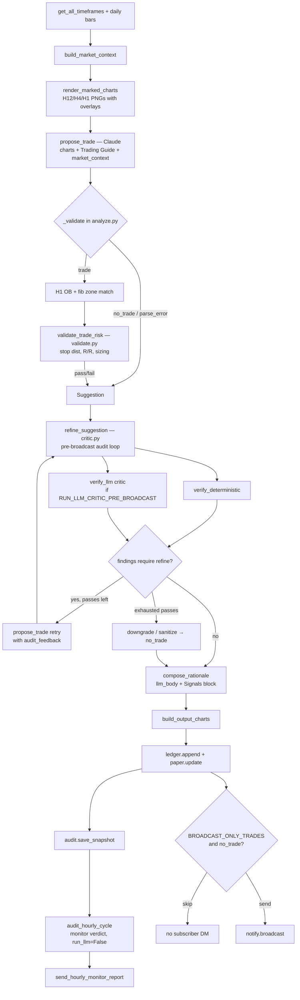
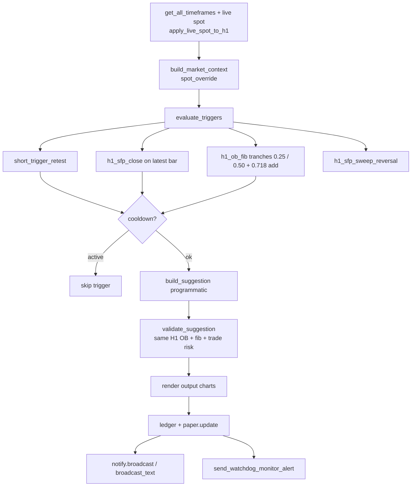
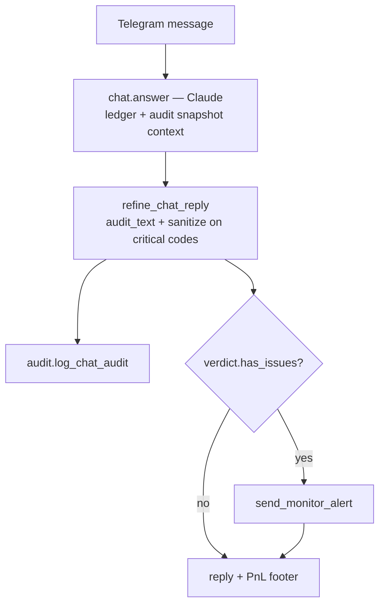
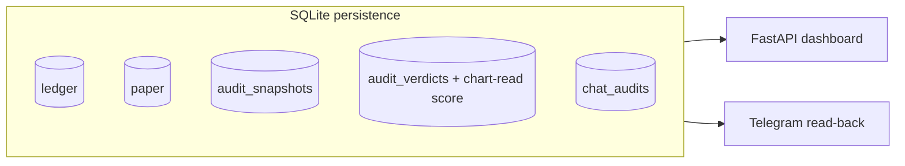

# Project state

> Single source of truth for architecture and status of the Telegram trading bot.
> See **Documentation maintenance** below — update this file (and related deploy docs) whenever behaviour changes.

**Last updated:** 2026-07-07

---

## Documentation maintenance

When you implement a change that affects architecture, runtime behaviour, config flags, deployment, or ops workflows, **update the relevant docs in the same PR/commit** — do not leave them stale.

| If you changed… | Update… |
|---|---|
| Agent flow, validation, audit, watchdog, chat, persistence, dashboard | `deploy/PROJECT_STATE.md` — diagrams, status table, config table, changelog |
| VPS setup, systemd, `.env`, subscriber onboarding, dashboard HTTPS, deploy scripts | `deploy/CLOUD.md` |
| New/changed deploy script, service unit, or one-off ops tool | The script **and** a short note in `deploy/CLOUD.md` (and changelog here if architectural) |
| `bot_config.py` tunables | Section 9 below **and** any CLOUD.md mention of that flag |

**Checklist before merging:**

- [ ] Status table and changelog reflect the change
- [ ] Mermaid diagrams still match the code path (hourly, watchdog, chat, persistence)
- [ ] Config defaults in section 9 match `bot_config.py`
- [ ] CLOUD.md updated if deploy or server ops steps changed

Related deploy docs: [`CLOUD.md`](CLOUD.md) · `setup.sh` · `update.sh` · `eth-agent.service` · `eth-dashboard.service`

---

## 1. What this system is

A Telegram bot that runs an hourly LLM-driven trading cycle and a sub-hourly programmatic watchdog over Coinbase OHLC data, validates and audits every suggestion before broadcast, paper-trades the results, and answers chat questions with ledger/audit context. All state is persisted to SQLite and surfaced through a FastAPI dashboard and Telegram read-back.

Three runtime paths (hourly, watchdog, chat), one shared data/context layer, shared persistence.

---

## 2. Top-level architecture

---

## 3. Data + market context layer

`research.py` pulls feeds from Coinbase; `patterns/market_context.py` → `build_market_context` assembles a `MarketContext` consumed by both the hourly cycle and the watchdog.

---

## 4. Hourly vision cycle (`agent.run_cycle`)

The LLM path: render charts → propose → validate → refine loop → compose → persist → broadcast → monitor audit.

---

## 5. Watchdog (`watchdog.run_watchdog`) — no LLM, sub-hourly

---

## 6. Chat Q&A (`bot.py on_text`)

---

## 7. Persistence + read consumers

Writers → stores:

| Store | Written by | Read by |
|---|---|---|
| `ledger` | hourly cycle, watchdog | dashboard, Telegram |
| `paper` | hourly cycle, watchdog | dashboard, Telegram |
| `audit_snapshots` | hourly cycle | dashboard, chat, monitor |
| `audit_verdicts` | hourly monitor, chat audit | dashboard |
| `chat_audits` | chat Q&A | — |

---

## 8. Component status

Legend: ✅ done · 🟡 in progress · 🔧 needs work · ⬜ planned · ⚠️ known issue

| Component | File(s) | Status | Notes |
|---|---|---|---|
| Coinbase OHLC ingest | `research.py` | ✅ | H12 resample, H4/H1 native, daily, live spot |
| Market context | `patterns/market_context.py` | ✅ | alerts, setup_tags, summary_text |
| SFP detection | `patterns/sfp.py` | ✅ | H12 + H1 |
| HTF zones | `patterns/htf_structure.py`, `patterns/zone_resolver.py` | 🟡 | resolve_zones tuning |
| Order blocks | `patterns/order_block.py` | 🟡 | H1 OB + fib matching |
| 24h range | `patterns/range_24h.py` | ✅ | |
| Bearish retest state | `patterns/setup_state.py` | ✅ | |
| Hourly cycle | `agent.py` | ✅ | |
| Trade proposal (LLM) | `analyze.py` | ✅ | JSON retry + `_validate` |
| Trade risk validation | `validate.py` | ✅ | stop dist, R/R, sizing |
| Refine / critic loop | `critic.py` | ✅ | pre-broadcast retries; post-cycle monitor |
| Watchdog | `watchdog.py` | ✅ | 3 triggers, cooldown, no LLM; macro soft gates |
| Macro context | `macro/` | ✅ | RSS poll, webhook ingest, keyword→Haiku classify, pulse, dashboard |
| Chat Q&A | `bot.py`, `chat.py` | ✅ | snapshot-grounded + chat audit |
| Persistence | `ledger.py`, `audit.py`, `paper.py` | ✅ | SQLite |
| Dashboard | `dashboard/` | 🟡 | FastAPI read-only + macro news monitor |
| Paper trading | `paper.py` | ✅ | fixed 25% deploy sizing, FIFO cap, epoch archives |
| Live execution | `execute.py` | ⬜ | shadow/live path not built |
| OHLC history cache | `ohlc_cache.py` | ✅ | research/backfill only, not hot path |
| Legacy scheduler | `scheduler.py` | ⚠️ | deprecated; use `main.py` |

---

## 9. Feature flags / config

Defaults from `bot_config.py` (non-secret tunables). Secrets and portfolio size live in `.env` — see `CLOUD.md`.

| Flag / setting | Default | Effect |
|---|---|---|
| `WATCHDOG_ENABLED` | `True` | enables sub-hourly watchdog job |
| `WATCHDOG_INTERVAL_SEC` | `180` | scan cadence (clamped 60–300s in `main.py`) |
| `WATCHDOG_COOLDOWN_SEC` | `21600` (6h) | suppress repeat fire on same H1 OB |
| `BROADCAST_ONLY_TRADES` | `True` | suppress `no_trade` subscriber DMs |
| `RUN_LLM_CRITIC_PRE_BROADCAST` | `True` | run LLM critic in refine loop |
| `MAX_REFINE_PASSES` | `3` | audit retry budget before downgrade |
| `MAX_OPEN_TRADES` | `20` | paper FIFO cap |
| `ENTRY_FIB_LOW` / `ENTRY_FIB_HIGH` | `0.25` / `0.50` | H1 OB entry band; watchdog tranches at each level |
| `ADD_FIB_LEVEL` | `0.718` | scale-in adds another `TRADE_DEPLOY_PCT` (1.25× max base exposure) |
| `ENTRY_TRANCHE_DEPLOY_PCT` | `0.125` | per-tranche deploy (half of `TRADE_DEPLOY_PCT`) |
| `TRADE_DEPLOY_PCT` | `0.25` | fixed fraction of **live paper equity** deployed as notional per full idea (R/R unaffected) |
| `MIN_ETH_QTY` / `MAX_ETH_QTY` | `0.25` / `2.0` | paper size guardrails after fixed-fraction sizing |
| `OB_MIN_WIDTH_PCT` | `1.25` | minimum OB zone width (% of mid price; H1 rule, all TFs) |
| `PAPER_EPOCH_LABEL` | `"5k_usd"` | dashboard epoch label |
| `MACRO_CONTEXT_ENABLED` | `True` | RSS poll + macro advisory injection |
| `MACRO_POLL_INTERVAL_SEC` | `300` | RSS poll cadence |
| `MACRO_MIN_SEVERITY_INJECT` | `3` | min LLM severity for prompt injection |
| `MACRO_PULSE_MIN_SEVERITY` | `4` | position-aware pulse + monitor alert |
| `MACRO_WATCHDOG_GATE_MIN_SEVERITY` | `4` | soft gate conflicting watchdog entries |
| `MACRO_LLM_PROMOTE_THRESHOLD` | `40` | min keyword_score before Haiku classify |
| `MACRO_DEFAULT_TTL_HOURS` | `24` | fallback TTL for classified events |
| hourly interval | `3600s` | `hourly_job` cadence in `main.py` |

---

## 10. Known issues / open questions

- [ ] Live execution path (`execute.py`, `EXECUTION_MODE=shadow|live`) not implemented — paper only
- [ ] Inline approve/reject on Telegram broadcasts not implemented (`notify.py` TODO)
- [ ] HTF zone / H1 OB resolver edge cases under active tuning

---

## 11. Changelog

| Date | Change |
|---|---|
| 2026-07-09 | Watchdog staged fib entries (12.5% @ 0.25 + 12.5% @ 0.50), 0.718 scale-in (+25%), and `h1_sfp_sweep_reversal` with stop at swept level. Entry band changed from 0.618–0.786 to 0.25–0.50 across guide, validation, and charts. |
| 2026-07-08 | Position sizing switched from 1% risk-based to fixed-fraction deployment (`TRADE_DEPLOY_PCT=0.25` of live paper equity); removed risk-capacity feasibility gate; `MAX_ETH_QTY` raised to `2.0`. R/R, stop, and TP logic unchanged. |
| 2026-07-07 | OB minimum width filter (`OB_MIN_WIDTH_PCT=1.25`): H1 + H12 detection and analyze validation |
| 2026-07-07 | Macro headline layer: RSS poll, webhook ingest, keyword→Haiku classify, pulse advisories, watchdog soft gates, dashboard macro monitor |
| 2026-07-07 | Added documentation maintenance section; filled config defaults; aligned diagrams with audit loops, watchdog, and chat path |
| 2026-07-07 | Initial project state document created |
