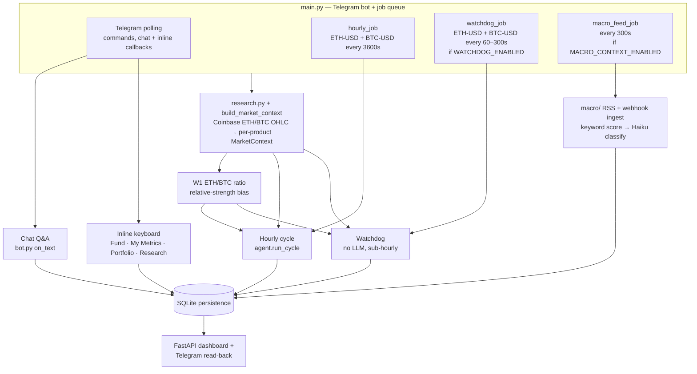
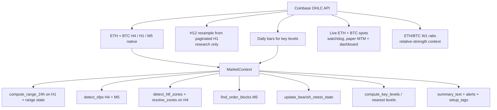
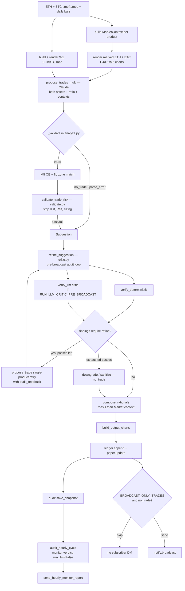
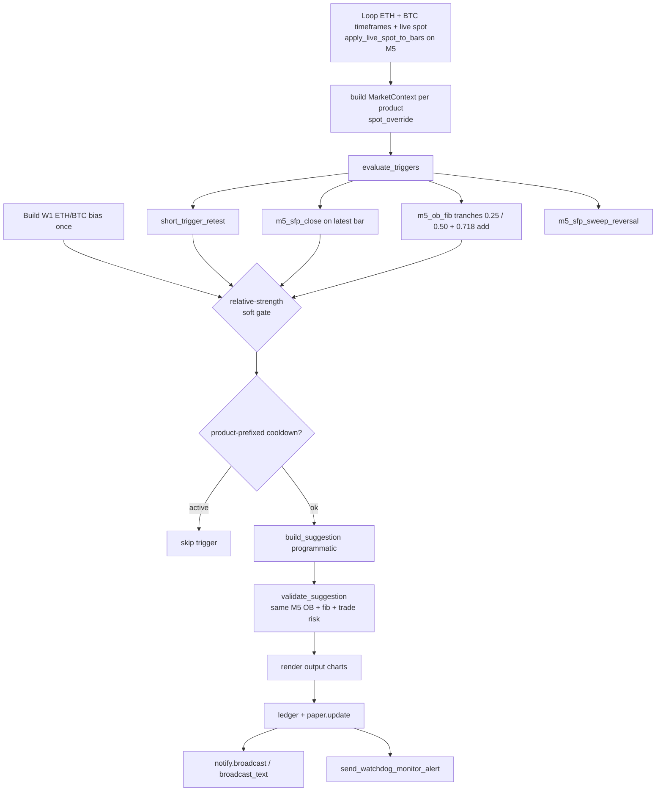
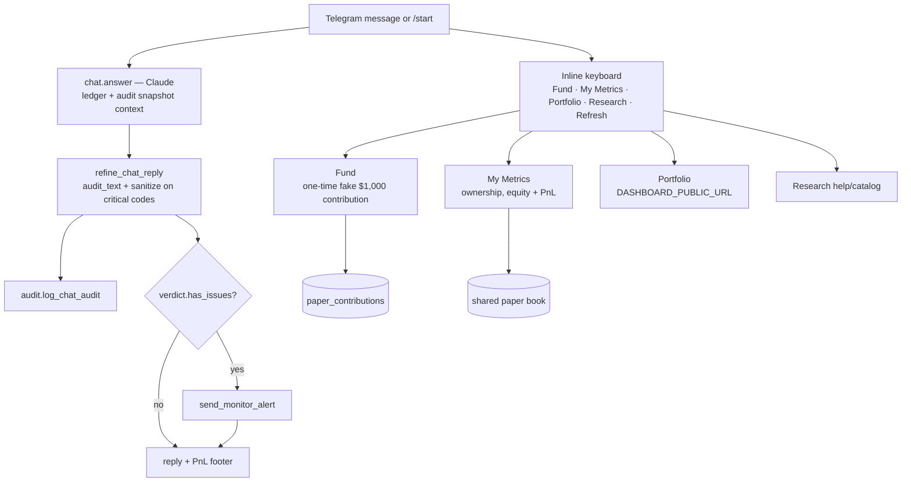
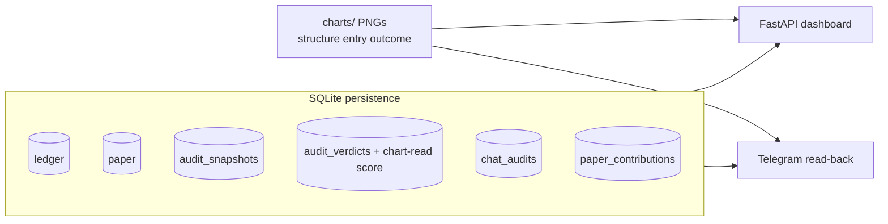

# Project state

> Single source of truth for architecture and status of the Telegram trading bot.
> See **Documentation maintenance** below — update this file (and related deploy docs) whenever behaviour changes.

**Last updated:** 2026-07-16

---

## Documentation maintenance

When you implement a change that affects architecture, runtime behaviour, config flags, deployment, or ops workflows, **update the relevant docs in the same PR/commit** — do not leave them stale.

| If you changed… | Update… |
|---|---|
| Agent flow, validation, audit, watchdog, chat, persistence, dashboard | `deploy/PROJECT_STATE.md` — diagrams, status table, config table, changelog |
| VPS setup, systemd, `.env`, subscriber onboarding, dashboard HTTPS, deploy scripts | `deploy/CLOUD.md` |
| New/changed deploy script, service unit, or one-off ops tool | The script **and** a short note in `deploy/CLOUD.md` (and changelog here if architectural) |
| `bot_config.py` tunables | Section 9 below **and** any CLOUD.md mention of that flag |

**Checklist before merging:**

- [ ] Status table and changelog reflect the change
- [ ] Mermaid diagrams still match the code path (hourly, watchdog, chat, persistence)
- [ ] Config defaults in section 9 match `bot_config.py`
- [ ] CLOUD.md updated if deploy or server ops steps changed

Related deploy docs: [`CLOUD.md`](CLOUD.md) · `setup.sh` · `update.sh` · `eth-agent.service` · `eth-dashboard.service`

---

## 1. What this system is

A Telegram bot that runs an hourly dual-asset LLM trading cycle and a sub-hourly dual-asset programmatic watchdog over Coinbase ETH-USD and BTC-USD data. W1 ETH/BTC relative strength biases asset selection and soft-gates watchdog entries. Every suggestion is validated and audited before broadcast, then applied to one shared paper book. Telegram users can make a one-time fake **Fund $1,000** contribution and track their proportional paper equity. State is persisted to SQLite and surfaced through a FastAPI dashboard and Telegram read-back.

Four operator-facing paths (hourly, watchdog, Telegram chat/inline UI, dashboard), one shared data/context layer, and one shared paper book.

---

## 2. Top-level architecture

---

## 3. Data + market context layer

`research.py` pulls ETH-USD and BTC-USD feeds from Coinbase; `patterns/market_context.py` → `build_market_context` assembles one `MarketContext` per product. `patterns/relative_strength.py` aligns weekly ETH and BTC bars into an ETH/BTC ratio, detects nearby W1 zones/SFPs, and infers `eth_strong`, `btc_strong`, or `neutral`. The hourly proposal receives that context as an asset preference; the watchdog rejects only entries that clearly fight it (long weaker asset or short stronger asset), so it remains a soft gate rather than a standalone signal.

Live strategy timeframes: **H4 → H1 → M5**. H12 remains available for research/historical studies only.

---

## 4. Hourly vision cycle (`agent.run_cycle`)

The LLM path builds both products plus W1 ETH/BTC context in one proposal call, then validates, refines, persists, and broadcasts each actionable product independently.

---

## 5. Watchdog (`watchdog.run_watchdog`) — no LLM, sub-hourly

---

## 6. Telegram chat + inline UI (`bot.py`, `telegram_ui.py`)

`Fund` is explicitly a beta placeholder for future real funding: it does not move real money. `paper.fund_user` accepts one contribution per Telegram ID, adds `$1,000` to shared paper cash/starting equity, and records ownership in `paper_contributions`. `My Metrics` marks the whole shared ETH/BTC book to current spots, then reports the user's proportional equity and P&L.

---

## 7. Persistence + read consumers

Writers → stores:

| Store | Written by | Read by |
|---|---|---|
| `ledger` | hourly cycle, watchdog | dashboard, Telegram |
| `paper` | hourly cycle, watchdog | dashboard, Telegram |
| `paper_contributions` | Telegram Fund callback; house seed on paper init/reset | Telegram Fund/My Metrics; dashboard aggregate contribution total |
| `audit_snapshots` | hourly cycle | dashboard, chat, monitor |
| `audit_verdicts` | hourly monitor, chat audit | dashboard |
| `chat_audits` | chat Q&A | — |
| `charts/` PNGs | hourly/watchdog output charts; `paper` close → `{cycle}_H4|M5_outcome.png` | dashboard `/api/chart`, Telegram |

---

## 8. Component status

Legend: ✅ done · 🟡 in progress · 🔧 needs work · ⬜ planned · ⚠️ known issue

| Component | File(s) | Status | Notes |
|---|---|---|---|
| Coinbase OHLC ingest | `research.py` | ✅ | H4/H1/M5 live; H12 resample research-only; daily; live spot |
| Market context | `patterns/market_context.py`, `patterns/relative_strength.py` | ✅ | per-product alerts/tags/summary plus W1 ETH/BTC bias |
| SFP detection | `patterns/sfp.py` | ✅ | H4 + M5 (live); H12 still used in research |
| HTF zones | `patterns/htf_structure.py`, `patterns/zone_resolver.py` | 🟡 | detect_zones on H4; resolve_zones tuning |
| Order blocks | `patterns/order_block.py` | 🟡 | M5 OB + fib matching |
| 24h range | `patterns/range_24h.py` | ✅ | computed on H1 bars |
| Bearish retest state | `patterns/setup_state.py` | ✅ | |
| Hourly cycle | `agent.py` | ✅ | dual ETH/BTC contexts, charts, per-product persistence/broadcast |
| Trade proposal (LLM) | `analyze.py` | ✅ | one 0–2 trade multi-asset call; single-product critic retries |
| Trade risk validation | `validate.py` | ✅ | stop dist, R/R, USD-notional sizing |
| Refine / critic loop | `critic.py` | ✅ | pre-broadcast retries; context-conflict ack; thesis + Market context compose; post-cycle monitor |
| Watchdog | `watchdog.py` | ✅ | loops ETH/BTC; one fire/product/tick; product cooldown; macro + ETH/BTC soft gates |
| Macro context | `macro/` | ✅ | RSS poll, webhook ingest, keyword→Haiku classify, pulse, dashboard |
| Chat Q&A | `bot.py`, `chat.py` | ✅ | snapshot-grounded + chat audit |
| Telegram research | `research_reports/`, `metrics/`, `analytics.py` | ✅ | `/research` catalog; snapshot digests + H12 SFP studies |
| Persistence | `ledger.py`, `audit.py`, `paper.py` | ✅ | SQLite |
| Dashboard | `dashboard/` | ✅ | dual ETH/BTC live spots; shared-book P&L; dollar trade size + qty; paginated cycles/closed trades; chart-read score tooltips; expandable dual H4/M5 charts |
| Paper trading | `paper.py` | ✅ | multi-asset (ETH/BTC) book, fixed 25% USD-notional deploy, per-product qty caps, user contributions, FIFO cap, epoch archives; outcome charts on close |
| Telegram beta UI | `bot.py`, `telegram_ui.py` | ✅ | inline Fund/My Metrics/Portfolio/Research/Refresh keyboard; one-time fake $1,000 contribution and proportional metrics |
| Live execution | `execute.py` | ⬜ | shadow/live path not built |
| OHLC history cache | `ohlc_cache.py` | ✅ | research/backfill only, not hot path |
| Legacy scheduler | `scheduler.py` | ⚠️ | deprecated; use `main.py` |

---

## 9. Feature flags / config

Defaults from `bot_config.py` (non-secret tunables). Secrets and portfolio size live in `.env` — see `CLOUD.md`.

| Flag / setting | Default | Effect |
|---|---|---|
| `WATCHDOG_ENABLED` | `True` | enables sub-hourly watchdog job |
| `WATCHDOG_INTERVAL_SEC` | `60` | scan cadence (clamped 60–300s in `main.py`) |
| `WATCHDOG_COOLDOWN_SEC` | `1800` (30m) | suppress repeat fire on same M5 OB |
| `BROADCAST_ONLY_TRADES` | `True` | suppress `no_trade` subscriber DMs |
| `RUN_LLM_CRITIC_PRE_BROADCAST` | `True` | run LLM critic in refine loop |
| `MAX_REFINE_PASSES` | `3` | audit retry budget before downgrade |
| `MAX_OPEN_TRADES` | `20` | paper FIFO cap |
| `ENTRY_FIB_LOW` / `ENTRY_FIB_HIGH` | `0.25` / `0.50` | M5 OB entry band; watchdog tranches at each level |
| `ADD_FIB_LEVEL` | `0.718` | scale-in adds another `TRADE_DEPLOY_PCT` (1.25× max base exposure) |
| `ENTRY_TRANCHE_DEPLOY_PCT` | `0.125` | per-tranche deploy (half of `TRADE_DEPLOY_PCT`) |
| `TRADE_DEPLOY_PCT` | `0.25` | fixed fraction of **live paper equity** deployed as notional per full idea (R/R unaffected) |
| `FIB_LEVEL_TOLERANCE_PCT` | `0.008` | looser "near" fib mark for M5 watchdog |
| `TRADED_PRODUCTS` | `("ETH-USD", "BTC-USD")` | products the hourly cycle and watchdog may trade concurrently |
| `PRODUCT_QTY_CAPS` | `{"ETH-USD": (0.25, 2.0), "BTC-USD": (0.005, 0.05)}` | per-product paper size guardrails used by `qty_caps(product_id)` |
| `MIN_ETH_QTY` / `MAX_ETH_QTY` | `0.25` / `2.0` | legacy aliases for the ETH entries in `PRODUCT_QTY_CAPS` |
| `RELATIVE_STRENGTH_ENABLED` | `True` | adds W1 ETH/BTC proposal bias and watchdog soft gate |
| `PAPER_CONTRIBUTION_USD` | `1000.0` | one-time fake Fund deposit per Telegram user |
| `HOUSE_CONTRIBUTION_TELEGRAM_ID` | `0` | reserved Telegram ID for the house seed row in `paper_contributions` |
| `OB_MIN_WIDTH_PCT` | `1.25` | minimum HTF (H4) OB zone width (% of mid price) |
| `OB_MIN_WIDTH_PCT_M5` | `0.15` | minimum M5 entry OB width (M5 candles are ~10× thinner than H1) |
| `PAPER_EPOCH_LABEL` | `"5k_usd"` | dashboard epoch label |
| `MACRO_CONTEXT_ENABLED` | `True` | RSS poll + macro advisory injection |
| `MACRO_POLL_INTERVAL_SEC` | `300` | RSS poll cadence |
| `MACRO_MIN_SEVERITY_INJECT` | `3` | min LLM severity for prompt injection |
| `MACRO_PULSE_MIN_SEVERITY` | `4` | position-aware pulse + monitor alert |
| `MACRO_WATCHDOG_GATE_MIN_SEVERITY` | `4` | soft gate conflicting watchdog entries |
| `MACRO_LLM_PROMOTE_THRESHOLD` | `40` | min keyword_score before Haiku classify |
| `MACRO_DEFAULT_TTL_HOURS` | `24` | fallback TTL for classified events |
| hourly interval | `3600s` | `hourly_job` cadence in `main.py` |

---

## 10. Known issues / open questions

- [ ] Live execution path (`execute.py`, `EXECUTION_MODE=shadow|live`) not implemented — paper only
- [ ] Inline approve/reject on Telegram broadcasts not implemented (`notify.py` TODO)
- [ ] HTF zone / M5 OB resolver edge cases under active tuning

---

## 11. Changelog

| Date | Change |
|---|---|
| 2026-07-16 | Trading Guide sizing section aligned to USD-notional contract; added `tests/test_relative_strength.py` (W1 ratio/soft-gate) and `tests/test_contributions.py` (Fund/My Metrics). |
| 2026-07-16 | Sizing contract switched to USD notional: `Suggestion.size` now stores deployed dollars, paper converts to ETH/BTC qty for P&L, and dashboard/Telegram show dollar size first with quantity secondary. |
| 2026-07-16 | Beta operator surfaces completed for dual-asset paper contributions: Telegram inline Fund/My Metrics/Portfolio/Research UX; dashboard ETH+BTC spots, asset labels, API pagination, and chart-read score tooltips; deployment/onboarding docs updated for public dashboard links and open beta access. |
| 2026-07-16 | Dual-asset runtime path: hourly Claude call analyzes ETH + BTC with W1 ETH/BTC preference, then refines/persists each product separately; watchdog loops both products with relative-strength soft gates and product-specific cooldowns. |
| 2026-07-16 | Paper multi-asset + contributions: `product_id`/`qty` on positions/trades (with `eth_qty` backcompat), spots-dict MTM, `qty_caps(product_id)`, `paper_contributions` + `fund_user` / `get_user_metrics`. |
| 2026-07-16 | Broadcast UX: thesis first (“Why this trade”), programmatic alerts relabeled **Market context** below. Hourly refine requires `CONTEXT_CONFLICT_UNACKNOWLEDGED` acknowledgment when action opposes context (opposite M5 OB / opposite-only primary H4); watchdog skipped. |
| 2026-07-14 | Dashboard chart lightbox: click thumbs / H4 / M5 charts to enlarge (Esc / backdrop / × to close). |
| 2026-07-14 | Dashboard tag tooltips filled from Trading Guide (ranging, H4/M5 SFP, M5 OB fib, macro gates); macro feed widened to 640px. |
| 2026-07-14 | Dashboard journal layout fix: trade summary button is the flex row (avoids nested-flex-in-button bugs), fixed `.trade-thumb-wrap` frames, full-width cards, cache-busted CSS. |
| 2026-07-14 | Dashboard UX polish: macro feed is a ~480px square with internal scroll; trade thumbs/expanded charts use fixed frames; journal headers left-aligned; expand keeps one continuous card background; more gap between trade cards. |
| 2026-07-14 | Dashboard **trade journal**: expandable open/closed/archived cards with dual H4 structure + M5 execution charts, levels (Entry/SL/TP/OB), P&L, and rationale. `/api/chart/{cycle}?kind=&tf=` serves structure/entry/outcome/marked; paper closes best-effort write `{cycle}_H4|M5_outcome.png` (Entry+Exit+P&L windowed to open→close). |
| 2026-07-14 | Fixed paper/watchdog scale-in bug that stacked many same-side M5 OB fills into one position (cash→0, ~2.6 ETH) and **reset SL to the latest fill**. Adds now only merge on matching `order_block_ref`, never widen SL, cap qty at `MAX_ETH_QTY`; watchdog blocks competing OB fib entries while one same-side OB position is open. |
| 2026-07-13 | M5 entry OB min width lowered via `OB_MIN_WIDTH_PCT_M5=0.15` (HTF stays `OB_MIN_WIDTH_PCT=1.25`). Live probe showed 59/59 M5 OB candidates rejected at 1.25% (widths ~0.05–0.47%). |
| 2026-07-13 | Removed HTF alignment hard-gate from watchdog (`_htf_allows_long/short`). Entries fire on M5 OB fib / SFP triggers; H4 zones remain context only. Softened market_context / Trading Guide / analyze prompts so HTF conflict no longer defaults to no_trade. |
| 2026-07-13 | Live stack **H4→H1→M5** wired through agent/analyze/charts/watchdog/critic/audit/dashboard/chat. Watchdog tags `m5_ob_*_in_fib`, triggers `m5_ob_fib_*` / `m5_sfp_*`; critic codes `M5_OB_MISLABEL` / `JSON_H4_AS_M5_OB`. Fib band 0.25–0.50 unchanged; `WATCHDOG_INTERVAL_SEC=60`, cooldown 30m, `FIB_LEVEL_TOLERANCE_PCT=0.008`. H12 research topics unchanged. |
| 2026-07-09 | `/research h12_invalidations` — last N H12 SFP invalidations with post-invalidation continuation vs mean-reversion stats + chart |
| 2026-07-09 | Expanded `/research`: topic catalog, standardized reports, market snapshot topics (digest, macro, funding, volume, dominance, miner), SFP studies via shared `ResearchReport` format |
| 2026-07-09 | Watchdog staged fib entries (12.5% @ 0.25 + 12.5% @ 0.50), 0.718 scale-in (+25%), and `h1_sfp_sweep_reversal` with stop at swept level. Entry band changed from 0.618–0.786 to 0.25–0.50 across guide, validation, and charts. |
| 2026-07-08 | Position sizing switched from 1% risk-based to fixed-fraction deployment (`TRADE_DEPLOY_PCT=0.25` of live paper equity); removed risk-capacity feasibility gate; `MAX_ETH_QTY` raised to `2.0`. R/R, stop, and TP logic unchanged. |
| 2026-07-07 | OB minimum width filter (`OB_MIN_WIDTH_PCT=1.25`): H1 + H12 detection and analyze validation |
| 2026-07-07 | Macro headline layer: RSS poll, webhook ingest, keyword→Haiku classify, pulse advisories, watchdog soft gates, dashboard macro monitor |
| 2026-07-07 | Added documentation maintenance section; filled config defaults; aligned diagrams with audit loops, watchdog, and chat path |
| 2026-07-07 | Initial project state document created |
