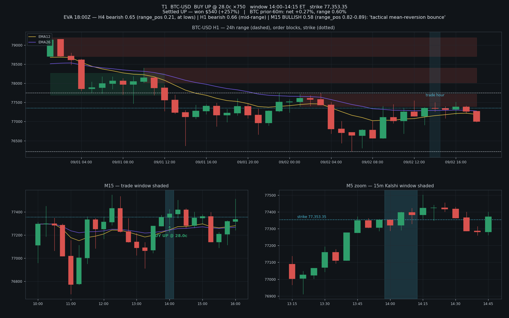
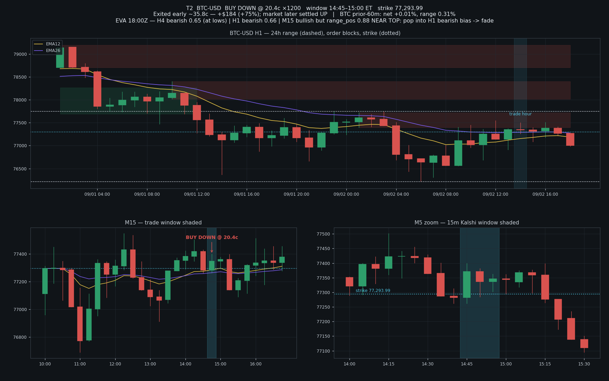
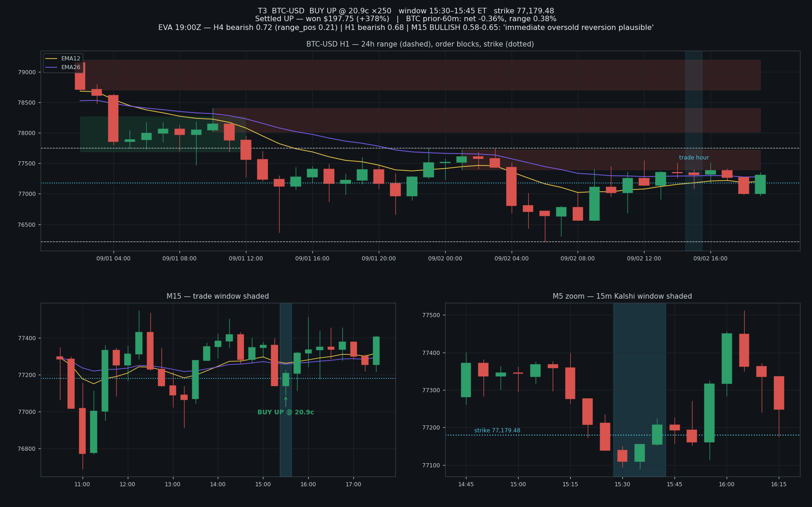
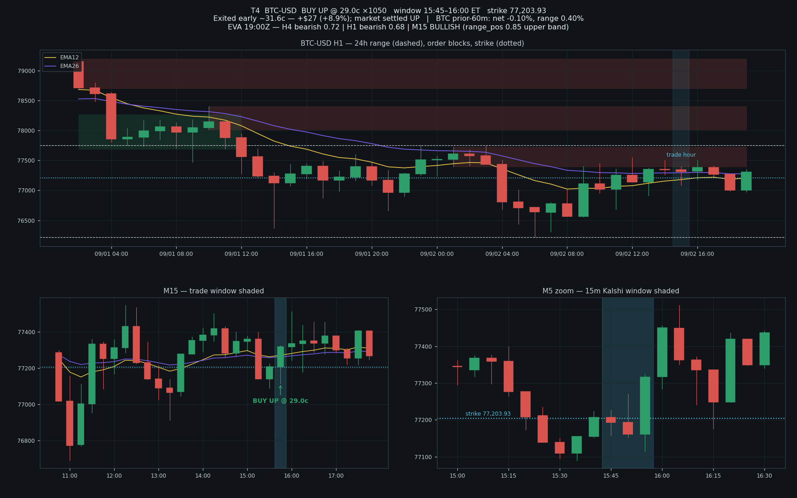
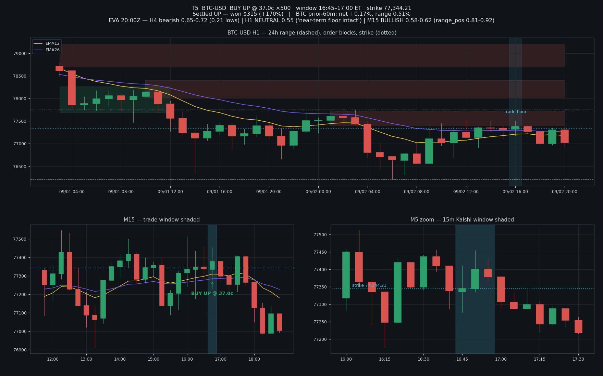
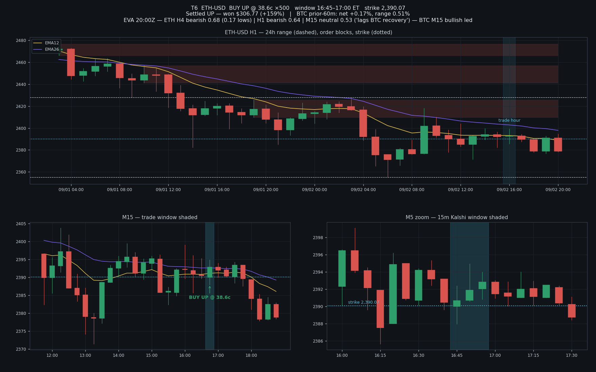
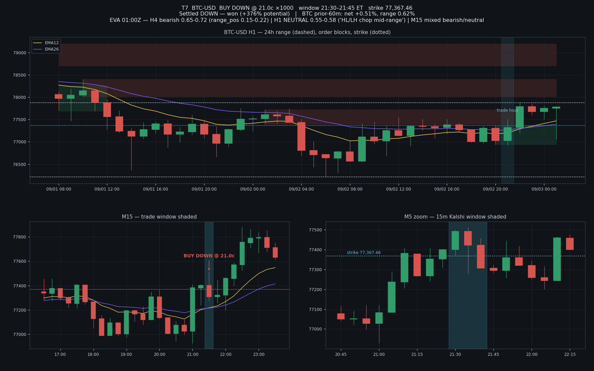
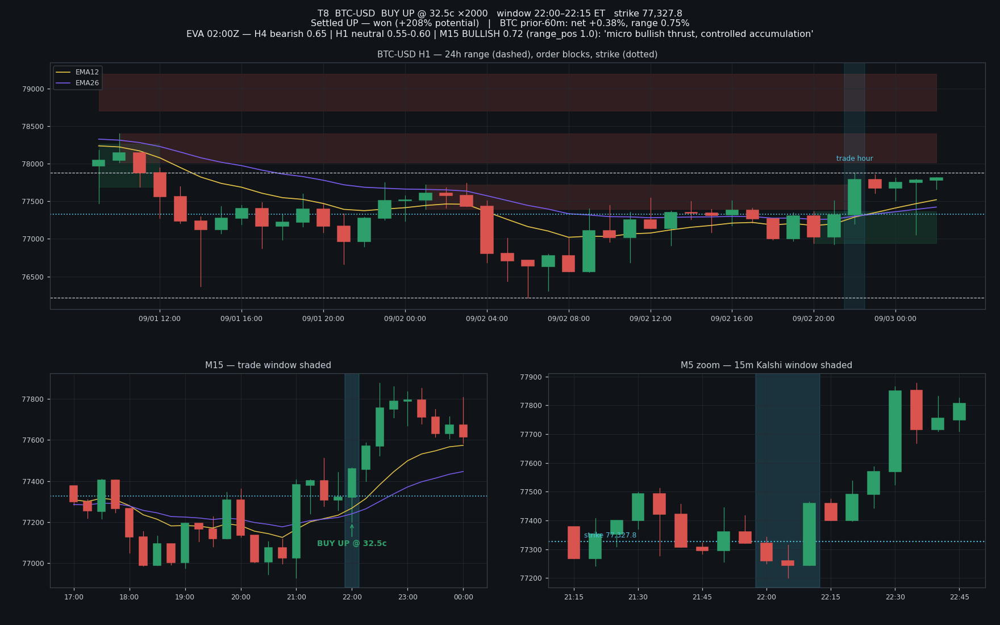

# Kalshi 15m Adverse/Wick Trades — Sep 2, 2026 — EVA Vision Reconstruction

Reverse-engineering of 8 winning manual Kalshi trades against **EVA's recorded brain state**
(`intel_stances` from the live hub ledger, pulled 2026-09-03) and **Coinbase BTC/ETH candles**.
Goal: rationale texts we can reuse as Telegram broadcast templates for the automated strategy.

**Method / provenance**

- EVA stances: `ssh root@45.33.97.27 → /opt/eth-trading-agent/ledger.db → intel_stances` (H4/H1/M15,
  hourly cycles, `source=llm`). Raw dump: `stances_raw.txt`. Zero new Claude calls.
- Price data: Coinbase public market API (H1/M15/M5), saved in `candles.json`.
- Each trade's window was **verified by matching the Kalshi strike to the candle open** at the
  window boundary (`fetch_verify.py`, `strike_matches.json`). Kalshi's index differs from Coinbase
  spot by roughly $10–40 on BTC, so matches are approximate but unambiguous.
- Charts (`t1…t8 png`): H1 with EMA12/26, 24h range (dashed), programmatic order blocks
  (pivot→MSB→last-opposite-candle, mirroring `patterns/htf_structure.py` — EVA's actual marked
  PNGs are overwritten each cycle and were not archived for Sep 2), M15 with the trade window +
  entry, M5 zoom with strike.

**Corrections found while verifying**

- The 😁 social card (Up 28¢, $77,353.35, $210→$750) is a **re-share of the 2:15 PM ET trade (T1)**,
  not a 10:15 PM trade — strike matches the 2:00 PM window open exactly.
- The "Again?" card (Up 32.5¢, $77,327.80) settles **10:15 PM ET** (22:00–22:15 window), and
  "Maybe" (Down 21¢, $77,367.46) settles **9:45 PM ET** (21:30–21:45 window).
- T2 and T4 were **sold early at a profit**, not held to settlement (T2's market actually settled
  UP after the exit — the fade was monetized mid-window).

---

## Trade table + rule check (vs the new boss rules)

| # | Window (ET) | Market | Side | Entry | Strike | Result | ≤33¢ | First/last 15 of hour | BTC 1h net / range |
|---|---|---|---|---|---|---|---|---|---|
| T1 | 2:00–2:15 PM | BTC | UP | 28¢ ×750 | 77,353.35 | Won +$540 | ✅ | ✅ :00 | +0.27% / 0.60% ✅ |
| T2 | 2:45–3:00 PM | BTC | DOWN | 20.4¢ ×1200 | 77,293.99 | Sold ~35.8¢ +$184 | ✅ | ✅ :45 | +0.01% / 0.31% ✅ |
| T3 | 3:30–3:45 PM | BTC | UP | 20.9¢ ×250 | 77,179.48 | Won +$198 | ✅ | ❌ :30 | −0.36% / 0.38% ✅ |
| T4 | 3:45–4:00 PM | BTC | UP | 29¢ ×1050 | 77,203.93 | Sold ~31.6¢ +$27 | ✅ | ✅ :45 | −0.10% / 0.40% ✅ |
| T5 | 4:45–5:00 PM | BTC | UP | 37¢ ×500 | 77,344.21 | Won +$315 | ❌ 37¢ | ✅ :45 | +0.17% / 0.51% ✅ |
| T6 | 4:45–5:00 PM | ETH | UP | 38.6¢ ×500 | 2,390.07 | Won +$307 | ❌ 38.6¢ | ✅ :45 | +0.17% / 0.51% ✅ |
| T7 | 9:30–9:45 PM | BTC | DOWN | 21¢ ×1000 | 77,367.46 | Won | ✅ | ❌ :30 | **+0.51% ❌** / 0.62% |
| T8 | 10:00–10:15 PM | BTC | UP | 32.5¢ ×2000 | 77,327.80 | Won | ✅ | ✅ :00 | +0.38% / 0.75% ✅ |

6 of 8 pass the ≤33¢ rule; 6 of 8 pass the hour-quarter rule; T7 marginally breaches the 0.5%
BTC-move rule. The bot with hard gates would have taken **T1, T2, T4, T8** as-is and skipped or
downsized the rest — worth remembering when comparing bot vs. manual performance.

## The day's EVA context (constant backdrop)

All afternoon and evening, EVA's brain read the same regime:

- **H4 BTC/ETH: bearish (conf 0.65–0.72), range_pos ≈ 0.15–0.27 — price sitting at the bottom of the multi-day range.**
- **H1: bearish early afternoon → neutral "HL/LH chop, mid-range" by evening.** Never bullish.
- **M15: repeatedly flipped bullish (0.55–0.72) with range_pos 0.8–1.0** — "tactical mean-reversion
  bounce", "immediate oversold reversion plausible", "micro bullish thrust, controlled accumulation".
- Macro: severity-4 risk-off (Iran escalation, oil >$93, bond rout) capping upside; funding
  bull-persist (BTC 18–19, ETH 44–45 periods) providing a floor. EVA medium summary: *"BTC ~77.3k
  support… tight 2.6–3.6% range… consolidation"*.

That combination — **hard floor under price, no trend, oscillation between range low and range
mid** — is exactly the regime where the wick/adverse strategy prints: buy whichever side is cheap
at an intra-range extreme.

---

## T1 — BTC UP 28¢ (2:00–2:15 PM ET) — won +$540

**EVA at 18:00Z:** H4 bearish 0.65 (range_pos 0.21, at lows) · H1 bearish 0.62–0.70 (mid-range) ·
**M15 bullish 0.55–0.62** (range_pos 0.82–0.89) — *"tactical mean-reversion within larger down move"*.

**Reconstruction.** BTC had flushed to ~77,290 in the prior half hour and was resting just above
the 24h range low with EVA calling the H4 at the bottom of its range and the M15 structure already
bullish (HH/HL forming, EMA12>26). The 2:00 PM window opened at 77,351 after the first bounce leg;
the market still priced UP at only 28¢ — the crowd was extrapolating the flush. Cheap UP + M15
bounce structure + hard H4 floor = buy the wick recovery. Price ran to 77,422 inside the window.

**Telegram draft:**
> 🟢 **BTC 15m — UP @ 28¢** (2:00–2:15 PM)
> BTC just swept the bottom of its 24h range and is basing. EVA: H4 at range lows, M15 structure
> flipped bullish (HH/HL, EMA cross). Market still pricing this window 72% down — that's the wick
> we buy. Cheap side + reversal structure + range floor underneath.

## T2 — BTC DOWN 20.4¢ (2:45–3:00 PM ET) — sold ~35.8¢, +$184

**EVA at 18:00Z:** H4 bearish 0.65 · **H1 bearish 0.66** · M15 bullish *but* range_pos 0.88 —
the bounce had already run to the top of its micro-range.

**Reconstruction.** The bounce from T1 extended to ~77,400 — the top of the intra-day corrective
range — while EVA's H1 and H4 were still firmly bearish ("LH+LL intact, macro risk-off"). The
window opened at 77,294-strike with price popping above it; DOWN got crushed to 20.4¢. That is the
textbook adverse entry: **market pricing 80% up into a bearish H1 at a local high**. Price faded
back through the strike mid-window; DOWN odds spiked and the position was sold at ~36¢ for +75%
without settlement risk (the window ultimately closed back up — taking profit on the wick was the
right call).

**Telegram draft:**
> 🔴 **BTC 15m — DOWN @ 20¢** (2:45–3:00 PM)
> Bounce just tagged the top of the corrective range at ~77.4k. EVA: H1 and H4 still bearish —
> lower highs, macro risk-off. Market pricing 80% up = DOWN on sale against the hourly lean.
> Fading the pop, not chasing the dip.

## T3 — BTC UP 20.9¢ (3:30–3:45 PM ET) — won +$198

**EVA at 19:00Z:** H4 bearish 0.72 (range_pos 0.21) · H1 bearish 0.68 · **M15 bullish 0.55–0.65** —
*"immediate oversold reversion plausible"*.

**Reconstruction.** The fade from T2 overshot: BTC dumped to 77,090 — a fresh sweep *below* the
prior afternoon low, back onto the 24h range floor. Window opened at 77,179 with UP priced at just
21¢ after the down candle. Same logic as T1 one level lower: liquidity sweep at the range low, M15
calling oversold reversion, H4 floor holding all day. Price reclaimed to 77,206 by settle.
*(Note: 3:30–3:45 window — the middle-of-hour quarter the new rules would skip.)*

**Telegram draft:**
> 🟢 **BTC 15m — UP @ 21¢** (3:30–3:45 PM)
> Stop-run below the afternoon low straight into the 24h range floor — the level that's held all
> day. EVA: M15 oversold-reversion setup inside an H4 range bottom. Market pricing 79% down after
> the flush = cheap wick-back entry.

## T4 — BTC UP 29¢ (3:45–4:00 PM ET) — sold ~31.6¢, +$27

**EVA at 19:00Z:** unchanged — H4 bearish at lows, H1 bearish, M15 bullish (range_pos 0.85).

**Reconstruction.** Continuation of T3's reclaim: the new window opened at 77,204 with UP still
only 29¢ while the M5s printed higher lows off the sweep. Second bite at the same wick. The move
stalled mid-window, so the position was scratched at ~32¢ for a small profit rather than gambling
the settle — discipline consistent with "this is a reversion trade, not a trend trade".

**Telegram draft:**
> 🟢 **BTC 15m — UP @ 29¢** (3:45–4:00 PM)
> Same reversion still in play — higher lows off the range-floor sweep, EVA M15 bullish, and the
> market still pricing this 71% down. Riding the second leg of the wick.

## T5 + T6 — BTC UP 37¢ / ETH UP 38.6¢ (4:45–5:00 PM ET) — won +$315 / +$307

**EVA at 20:00Z:** BTC — H4 bearish (0.21 lows) · **H1 softened to neutral 0.55** (*"consolidation…
near-term floor intact"*) · M15 bullish 0.58–0.62 (range_pos 0.81–0.92). ETH — H4 bearish 0.68 ·
H1 bearish 0.64 · M15 neutral (*"lags BTC recovery"*).

**Reconstruction.** By 4:45 PM the reversion had matured into a grind higher: BTC H1 no longer
bearish (neutral, floor intact) and M15 momentum near the top of its band. Both windows opened
mid-push (BTC 77,344 / ETH 2,390) and both UP sides were still priced under 40¢. This pair is
**momentum-continuation, not pure adverse** — and it shows in the price paid: 37–38.6¢ breaches
the new ≤33¢ cap. ETH is the weakest-thesis trade of the day (EVA's ETH H1 was still bearish);
it worked because ETH followed BTC's bounce beta. The bot would skip both under the new rules.

**Telegram draft (as the bot *would* phrase a compliant version):**
> 🟢 **BTC 15m — UP @ 33¢ or better only** (4:45–5:00 PM)
> Reversion matured: EVA H1 upgraded to neutral with the floor intact, M15 still bullish. We only
> take this if the market keeps mispricing the grind — no chasing above 33¢.

## T7 — BTC DOWN 21¢ (9:30–9:45 PM ET) — won

**EVA at 01:00Z:** H4 bearish 0.65–0.72 (range_pos 0.15–0.22) · H1 neutral 0.55–0.58 (*"HL/LH chop
mid-range"*) · M15 mixed bearish/neutral.

**Reconstruction.** Evening chop: BTC popped to 77,512 — the top of the evening micro-range and
right into the H1 order-block/supply shelf — inside a window whose strike was 77,367. DOWN got
priced at 21¢ with price ~$100 above strike. H4 still bearish, H1 rangebound: a pop to range top
inside a capped, directionless hour is exactly the "candles wick" bet. Price mean-reverted to
77,307 by settle. *(Two rule flags: 9:30–9:45 is a mid-hour quarter, and BTC's trailing-hour net
move was +0.51% — marginally over the 0.5% gate. The bot would have passed on this one.)*

**Telegram draft:**
> 🔴 **BTC 15m — DOWN @ 21¢** (9:30–9:45 PM)
> Spike into the top of the evening range + H1 supply shelf, EVA H4 still bearish, hour is pure
> chop. Price is $100 above the strike with 15 minutes left — most candles don't close on their
> highs. Buying the wick down while it's 21¢.

## T8 — BTC UP 32.5¢ (10:00–10:15 PM ET) — won

**EVA at 02:00Z:** H4 bearish 0.65 · H1 neutral 0.55–0.60 · **M15 bullish 0.72 (range_pos 1.0)** —
*"micro bullish thrust… controlled accumulation… short-term oversold rebound likely"*.

**Reconstruction.** The mirror of T7 one window later: the fade overshot to 77,200 (evening range
low), then EVA's strongest M15 signal of the night fired — bullish 0.72 at range_pos 1.0. Window
opened 77,321-strike with price recovering from below; UP still 32.5¢. Range-bottom + strongest
micro-thrust reading + cheap side + first-15-of-hour window = full-alignment entry (biggest size
of the day, 2,000 shares). Price ripped to 77,466.

**Telegram draft:**
> 🟢 **BTC 15m — UP @ 32.5¢** (10:00–10:15 PM)
> Same range, other edge: the fade overshot into the evening low and EVA's M15 just printed its
> strongest bullish thrust of the night (0.72, top of range position). Market still pricing 67%
> down = cheap reversal. Range low → range mid is the trade.

---

## What these examples teach the broadcast format

Every winning rationale reduces to the same four sentences, which is the proposed Telegram template:

1. **Location** — where price is inside the H1/24h range (floor, ceiling, mid), ideally after a sweep.
2. **EVA lean** — the stance stack (H4 / H1 / M15) with the one reading that matters bolded.
3. **Mispricing** — what the Kalshi market is implying vs. that lean ("pricing 80% up into a bearish H1").
4. **The bet** — one line naming the wick logic ("candles don't close on their highs/lows").

Template:

> {🟢/🔴} **{BTC|ETH} 15m — {UP|DOWN} @ {price}¢** ({window} ET)
> {Location sentence}. EVA: {H4 stance} / {H1 stance} / {M15 stance}. Market pricing {implied}%
> against the lean — {wick logic sentence}. {Optional: skip-context, e.g. "sized down: mid-hour window".}

## Caveats

- Order blocks on the charts are recomputed programmatically (same pivot/MSB logic as the repo);
  EVA's actual marked PNGs from Sep 2 were overwritten by later cycles.
- Kalshi strikes come from Kalshi's own index; Coinbase spot ran ~$10–40 rich/poor at times, so
  strike lines on the charts are approximate against Coinbase candles.
- EVA cycles are hourly (bucketed on the hour, UTC); stances quoted are the cycle in force at
  window open. Multiple rows per hour reflect intra-cycle retries; consensus values quoted.
- T2/T4 payouts in the app reflect early sells, not settlement values.

## Files

| File | Contents |
|---|---|
| `t1…t8*.png` | Per-trade marked charts (H1 + M15 + M5) |
| `stances_raw.txt` | Full EVA stance/medium dump, Sep 2 16:00Z → Sep 3 03:00Z |
| `candles.json` | Coinbase H1/M15/M5 candles used |
| `strike_matches.json`, `trade_stats.json` | Window verification + rule-check stats |
| `fetch_verify.py`, `chart_gen.py`, `probe_*.py`, `stances.sql` | Reproduction scripts |
