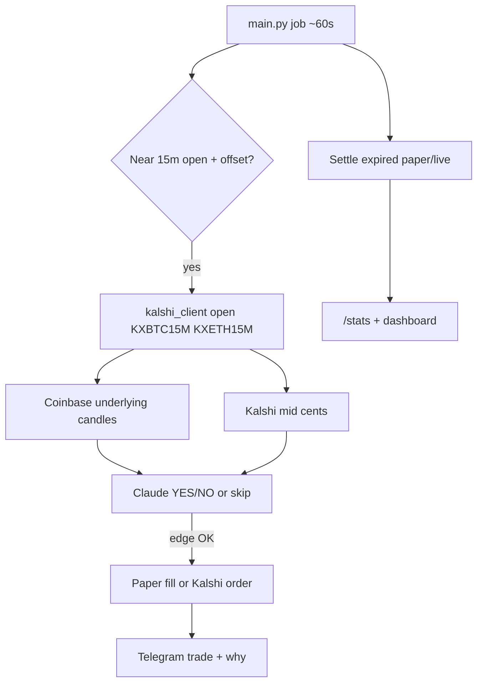

# Kalshi BTC/ETH 15m fork — mindless checklist

**Locked defaults (do not reinvent mid-stream):**
- Run **locally on Windows** through all paper phases; VPS is an optional last phase.
- Use a **brand-new Telegram bot** (do not reuse the spot bot token).
- Trade series **`KXBTC15M`** and **`KXETH15M`** (Kalshi 15-minute up/down).
- **Paper fills first**, then **Kalshi demo API**, then **production** live orders.
- Strategy: Claude picks YES/NO from underlying Coinbase spot + recent candles + Kalshi mid; only “trade” when mid is off a simple fair value / edge threshold; settle at window end from Kalshi market result.
- Telegram: post **trade + why** only; `/stats` for performance. No Accept/Reject, personal books, macro, z-move, or ICT watchdog.

**Phases:** 0 clone → 1 env → 2 Cursor rewrite → 3 paper soak → 4 demo live → 5 prod (optional)

---

## Phase 0 — Clone and open a new Cursor project

Your spot bot remote is `https://github.com/abagui11/eth-trading-bot.git`. Do this in PowerShell:

```powershell
cd C:\Users\abagu\OneDrive\Documents\Republic
git clone https://github.com/abagui11/eth-trading-bot.git kalshi_15m_bot
cd kalshi_15m_bot
git remote rename origin upstream
# Optional: create empty https://github.com/abagui11/kalshi_15m_bot.git on GitHub, then:
# git remote add origin https://github.com/abagui11/kalshi_15m_bot.git
# git push -u origin HEAD
```

If `git clone` fails (private repo / auth), copy the local folder instead:

```powershell
cd C:\Users\abagu\OneDrive\Documents\Republic
Copy-Item -Recurse .\trading_bot_MVP .\kalshi_15m_bot
cd .\kalshi_15m_bot
Remove-Item -Recurse -Force .\.git -ErrorAction SilentlyContinue
git init
git add .
git commit -m "Initial Kalshi 15m fork from trading_bot_MVP"
```

Then:
1. Open **Cursor → File → Open Folder** → `C:\Users\abagu\OneDrive\Documents\Republic\kalshi_15m_bot`
2. Delete stale local DBs so you never mix spot history into Kalshi paper: `ledger.db`, `ohlc.db` if present; clear `charts\` PNGs.
3. Create a venv and install deps:

```powershell
python -m venv .venv
.\.venv\Scripts\Activate.ps1
pip install -r requirements.txt
pip install cryptography
```

**Gate 0:** `python -c "import anthropic, telegram, fastapi, dotenv; print('ok')"` prints `ok`.

---

## Phase 1 — Credentials and `.env` (no code changes yet)

### 1A. Telegram (new bot)

1. In Telegram, message `@BotFather` → `/newbot` → name it e.g. `Kalshi15m Paper Bot`.
2. Copy the token.
3. Message your new bot `/start`.
4. Get your numeric user id (e.g. `@userinfobot` or any id bot) → that is `ALLOWED_TELEGRAM_IDS`.

### 1B. Anthropic

Reuse the same key as the spot bot, or create a new one. Model default: `claude-sonnet-4-6`.

### 1C. Kalshi (demo first)

1. Create/login at Kalshi **demo** (use Kalshi’s demo account flow if offered; otherwise create API keys on the account you will use for demo endpoint).
2. Account → API Keys → Create Key.
3. Save **API Key ID** (UUID) and download the **`.key` private key file**.
4. Put the key file in the project (gitignored):  
   `C:\Users\abagu\OneDrive\Documents\Republic\kalshi_15m_bot\secrets\kalshi_demo.key`

### 1D. Write `.env`

From the project root:

```powershell
Copy-Item .\.env.example .\.env
notepad .\.env
```

Replace the file contents with this template (fill blanks):

```env
# --- LLM ---
ANTHROPIC_API_KEY=sk-ant-...
ANTHROPIC_MODEL=claude-sonnet-4-6

# --- Telegram (NEW bot only) ---
TELEGRAM_BOT_TOKEN=123456:ABC...
PAYWALL_ENABLED=true
ALLOWED_TELEGRAM_IDS=YOUR_NUMERIC_TELEGRAM_ID
TELEGRAM_CHAT_ID=
TELEGRAM_ADMIN_CHAT_ID=
MONITOR_CHAT_ID=
DASHBOARD_PUBLIC_URL=
DASHBOARD_PORT=8081

# --- Spot underlying (Coinbase public; still used for direction context) ---
MARKET_DATA_API=https://api.coinbase.com/api/v3/brokerage/market

# --- Paper bankroll (house book) ---
PORTFOLIO_VALUE=1000
PAPER_PORTFOLIO_VALUE=1000

# --- Kalshi (Phase 1–3: demo + paper; Phase 4 switches LIVE) ---
KALSHI_ENV=demo
KALSHI_API_BASE=https://external-api.demo.kalshi.co/trade-api/v2
KALSHI_API_KEY_ID=your-uuid-here
KALSHI_PRIVATE_KEY_PATH=secrets/kalshi_demo.key
KALSHI_SERIES=KXBTC15M,KXETH15M
KALSHI_PAPER_ONLY=true
KALSHI_MAX_CONTRACTS=5
KALSHI_MIN_EDGE_CENTS=3
KALSHI_CYCLE_OFFSET_SEC=30
```

Notes:
- Keep `PAYWALL_ENABLED=true` so only you get posts while testing.
- `DASHBOARD_PORT=8081` avoids clashing with the spot bot’s `8080`.
- `KALSHI_PAPER_ONLY=true` means never send real orders even if keys work.
- Production later: `KALSHI_ENV=prod`, `KALSHI_API_BASE=https://external-api.kalshi.com/trade-api/v2`, new prod key file, `KALSHI_PAPER_ONLY=false`.

Add to `.gitignore` if missing:

```
secrets/
*.key
.env
ledger.db
ohlc.db
```

**Gate 1 — smoke checks (before refactor):**

```powershell
# Coinbase still reachable
python -c "import requests,os; from dotenv import load_dotenv; load_dotenv(); print(requests.get(os.environ['MARKET_DATA_API']+'/products/BTC-USD/ticker',timeout=20).status_code)"

# Kalshi public markets (no auth)
python -c "import requests; r=requests.get('https://external-api.kalshi.com/trade-api/v2/markets',params={'series_ticker':'KXBTC15M','limit':3},timeout=20); print(r.status_code, list(r.json().get('markets',[]))[:1])"
```

Expect `200` and at least some market JSON (open markets may be empty briefly between windows — retry near :00/:15/:30/:45).

---

## Phase 2 — Cursor rewrite prompt (paste once)

In the **new** Cursor project (`kalshi_15m_bot`), switch to **Agent mode** and paste this entire prompt:

---

**CURSOR AGENT PROMPT — Phase 2 (paste as one message)**

```
You are converting this repo from a Coinbase ETH/BTC ICT spot paper trader into a Kalshi BTC/ETH 15-minute up/down paper bot.

GOALS
- Discover open markets for series KXBTC15M and KXETH15M via Kalshi API.
- Each cycle (aligned to 15m windows + KALSHI_CYCLE_OFFSET_SEC): for BTC and ETH, fetch Kalshi market mid + Coinbase underlying recent candles, ask Claude for YES/NO (or skip) with a short rationale, only act if edge vs mid >= KALSHI_MIN_EDGE_CENTS.
- Paper fill at mid; settle at market close from Kalshi result (YES wins $1/contract else $0); track house paper PnL in SQLite.
- Telegram: on each paper trade, post only "trade + why" to ALLOWED_TELEGRAM_IDS. Add /stats that prints equity, win rate, realized PnL, last 10 trades.
- Thin dashboard: show equity + open/closed Kalshi paper trades. Port from DASHBOARD_PORT.

ENV (already in .env — wire config.py to these)
KALSHI_ENV, KALSHI_API_BASE, KALSHI_API_KEY_ID, KALSHI_PRIVATE_KEY_PATH, KALSHI_SERIES, KALSHI_PAPER_ONLY, KALSHI_MAX_CONTRACTS, KALSHI_MIN_EDGE_CENTS, KALSHI_CYCLE_OFFSET_SEC
Keep existing required keys working; MARKET_DATA_API stays for Coinbase underlying.

DELETE / DISABLE (remove imports, jobs, and dead files if unused)
- ICT order-block / fib validation path as trade gate (analyze._validate_order_block_entry, watchdog fib triggers)
- Personal Accept/Reject books (user_books Accept flow, trade_offers UX)
- Macro feed job, zmove job, relative-strength soft gate as required path
- Trading Guide dependency for entries
- Subscriber paywall complexity beyond ALLOWED_TELEGRAM_IDS allowlist
Keep files only if still imported by the new path; otherwise delete.

REWRITE / ADD
1. kalshi_client.py — RSA-PSS auth per Kalshi docs; get_markets(series); get_market; get_orderbook mid; get_market_result/settle fields; place_order stub no-op when KALSHI_PAPER_ONLY=true
2. kalshi_cycle.py (or rewrite agent.run_cycle) — 15m window job; propose; paper open; settle expired
3. models — Suggestion-like record with: series, market_ticker, side YES|NO, contracts, entry_cents, expiry_ts, rationale, product_id BTC|ETH
4. paper.py — binary settlement (not SL/TP spot qty). Simplify schema; new empty ledger.db is fine
5. notify.py — broadcast_plain_text style card: asset, side, contracts, entry¢, expiry, why. No Accept buttons.
6. bot.py — /start, /stats, maybe /positions. Remove research/macro/accept callbacks.
7. main.py — one kalshi_job on interval ~60s that: settles due markets; if near new window offset, runs decision cycle. Disable hourly ICT + watchdog + macro + zmove jobs.
8. config.py + .env.example — document new Kalshi keys; make old ICT-only keys optional or remove from _REQUIRED_KEYS if unused
9. bot_config.py — strip fib/OB/watchdog defaults; add KALSHI_* mirrors if needed
10. dashboard — simplify to Kalshi paper performance (reuse dashboard/performance.py ideas)
11. deploy/PROJECT_STATE.md + deploy/CLOUD.md — rewrite for Kalshi 15m architecture; update changelog
12. requirements.txt — add cryptography

CONSTRAINTS
- Do not commit secrets. Keep secrets/ and .env gitignored.
- Paper path must work with KALSHI_PAPER_ONLY=true using public market data if auth fails for reads (prefer authenticated when keys present).
- After edits, give me exact PowerShell commands to run a one-shot cycle and /stats.

Implement fully for paper mode. Do not enable live orders yet.
```

---

**Gate 2:** After Agent finishes:

```powershell
.\.venv\Scripts\Activate.ps1
python -c "from kalshi_client import get_open_markets; print(get_open_markets('KXBTC15M')[:1])"
# exact one-shot command the agent told you, e.g.:
python -c "from kalshi_cycle import run_once; run_once()"
```

Expect: discovers markets, may skip or paper-open, Telegram DM arrives with trade+why **or** a clear “skipped: no edge” log. `/stats` works after you start the bot:

```powershell
python main.py
```

In Telegram: `/stats` → equity / trades (even if zero).

---

## Phase 3 — Paper soak (no live money)

Run for **at least 8–12 closed 15m windows** (2–3 hours).

Checklist each hour:
- [ ] Bot stays up (`python main.py`)
- [ ] Telegram posts only when a trade is taken
- [ ] After each window, position settles; `/stats` win rate moves
- [ ] Dashboard `http://127.0.0.1:8081` shows same equity as `/stats`
- [ ] No Accept/Reject buttons, no spot ICT charts required

**Gate 3:** At least 10 settled paper trades in SQLite; no crashes; PnL math looks like `(payout - entry_cents/100) * contracts` with payout 1 or 0.

Optional Cursor follow-up if broken:

```
Fix paper settlement and /stats so closed Kalshi 15m trades show correct binary PnL. Reproduce with a one-shot settle. Do not add live orders.
```

---

## Phase 4 — Kalshi demo live orders (small size)

Only after Gate 3.

1. Confirm demo balance via authenticated call (Agent should have a helper; or ask Agent: “add `python -m kalshi_client balance` CLI”).
2. In `.env` set:

```env
KALSHI_PAPER_ONLY=false
KALSHI_MAX_CONTRACTS=1
KALSHI_MIN_EDGE_CENTS=5
```

3. Restart `python main.py`.
4. Verify one real **demo** fill appears in Kalshi demo UI and Telegram.

**Gate 4:** One demo round-trip (open + settle) matches Kalshi demo portfolio and `/stats`.

---

## Phase 5 — Production Kalshi (optional; real money)

1. Create **production** API key; save `secrets/kalshi_prod.key`.
2. Update `.env`:

```env
KALSHI_ENV=prod
KALSHI_API_BASE=https://external-api.kalshi.com/trade-api/v2
KALSHI_API_KEY_ID=<prod-uuid>
KALSHI_PRIVATE_KEY_PATH=secrets/kalshi_prod.key
KALSHI_PAPER_ONLY=false
KALSHI_MAX_CONTRACTS=1
```

3. Restart bot. Keep caps tiny until you trust it.
4. Optional VPS: copy `deploy/CLOUD.md` flow but rename services to `kalshi-agent` / port `8081`, new directory `/opt/kalshi-15m-bot`, never share the spot bot’s `.env` or `ledger.db`.

**Gate 5:** One tiny live trade; Telegram + Kalshi UI + `/stats` agree.

---

## Architecture after rewrite



---

## What you delete (mental model)

| Keep shell | Remove product |
|---|---|
| `main.py` job runner, Telegram polling | ICT hourly `agent.run_cycle` OB/fib path |
| Allowlist + notify post | Accept/Reject + `user_books` offers UX |
| SQLite + thin dashboard | Macro / zmove / W1 RS as core |
| Claude call | Spot SL/TP paper engine semantics |

---

## If stuck

Re-paste into Agent with the failing Gate number and the exact error traceback. Do not jump to Phase 4 until Gate 3 passes.
